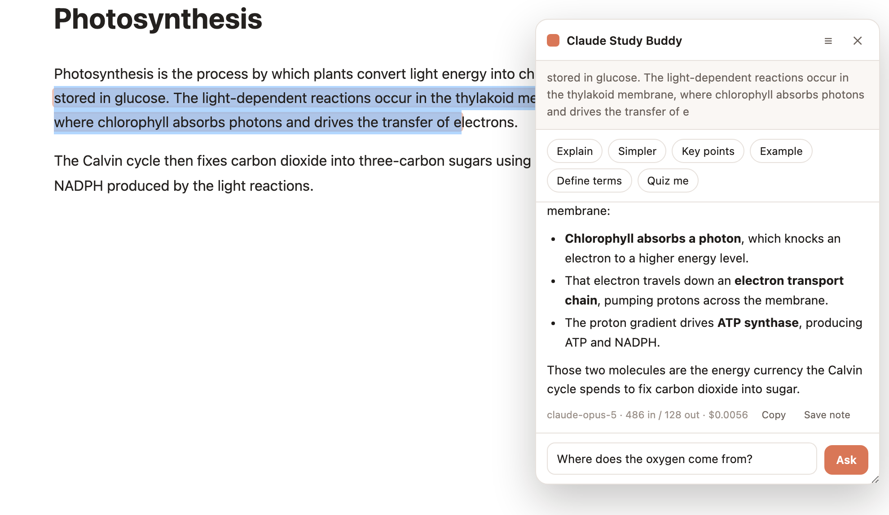
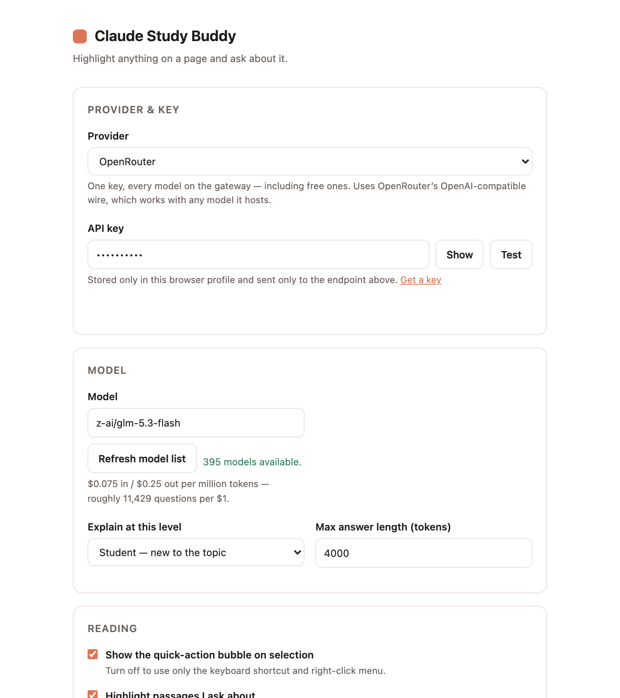
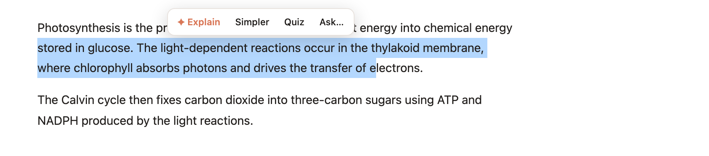
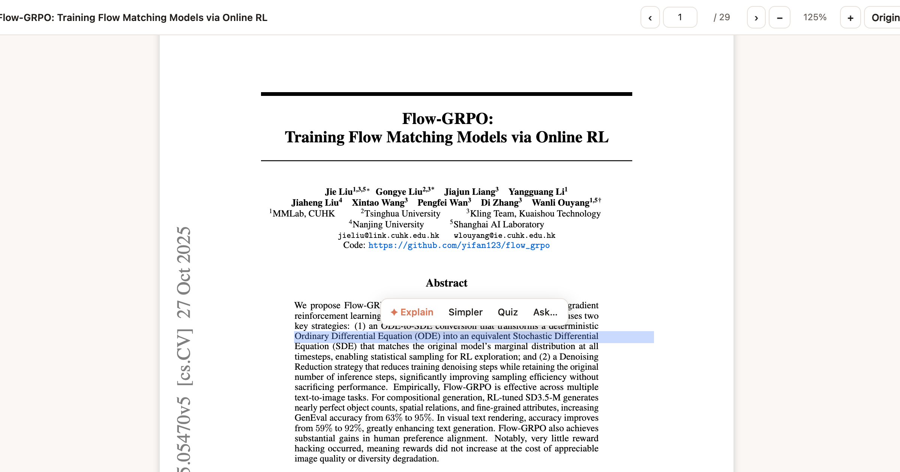

# Study Buddy

A Chrome extension for reading hard things. Highlight a passage on any page and ask an AI model to
explain it, simplify it, define the jargon, or quiz you on it — without leaving the page.



## Install

1. Open `chrome://extensions` and turn on **Developer mode** (top right).
2. Click **Load unpacked** and pick this folder.
3. The settings page opens on first install — pick a **provider**, paste its API key, and hit
   **Test**.

The key is stored in `chrome.storage.local` for this browser profile. Requests are made from the
extension's background worker straight to the provider — the key is never exposed to the pages you
browse, and nothing is sent anywhere else.

## Providers and what a question costs

Every provider here speaks the Anthropic Messages API, so switching one is a base-URL swap. Pick it
in settings, or flip between them from the toolbar popup mid-session.



| Provider | Model | $/M in → out | ≈ per question | Questions per $1 |
| --- | --- | --- | --- | --- |
| Anthropic | Opus 5 | 5 → 25 | $0.0075 | ~130 |
| Anthropic | Sonnet 5 | 2 → 10 | $0.0030 | ~330 |
| Anthropic | Haiku 4.5 | 1 → 5 | $0.0015 | ~670 |
| Z.ai / OpenRouter | GLM-5.3 | 1.40 → 4.40 | $0.0016 | ~630 |
| Z.ai / OpenRouter | **GLM-5.3-Flash** | 0.075 → 0.25 | **$0.00009** | **~11,000** |
| OpenRouter | DeepSeek V4 Flash | 0.065 → 0.18 | $0.00007 | ~14,000 |
| OpenRouter | anything `:free` | 0 → 0 | $0 | — |

Sized on a typical question (≈500 tokens in, 200 out); the panel shows the real number under every
answer. GLM-5.3-Flash is at promotional pricing (50% off) as of writing.

- **Anthropic** — Claude models, billed per token.
- **Z.ai** — GLM over `https://api.z.ai/api/anthropic`, which speaks the Messages API natively.
  Key: [z.ai](https://z.ai/manage-apikey/apikey-list).
- **OpenRouter** — one key, ~400 models including free ones. Settings pulls the live catalog with
  current per-token prices, so the model box autocompletes and the cost readout stays accurate; hit
  *Refresh model list* to re-pull. Key: [openrouter.ai/keys](https://openrouter.ai/keys).
- **Custom endpoint** — anything else: a gateway, a proxy, a local server. Pick the API shape
  (Anthropic Messages or OpenAI Chat Completions), enter the base URL, click *Grant access to this
  host* so Chrome allows the origin, and type the model name.

Two request shapes are implemented. OpenRouter uses the **OpenAI Chat Completions** wire because its
Anthropic-compatible endpoint is documented as Anthropic-models-only, and the point of OpenRouter
here is the cheap non-Anthropic models. Everything else uses the **Anthropic Messages** wire.

Effort, refusal fallbacks, workspace IDs and reasoning display are Anthropic-specific and are simply
not sent to other providers. On the Anthropic wire with a non-Anthropic provider, the key goes out as
both `Authorization: Bearer` and `x-api-key`, since gateways differ on which they read.

> There is no way to bill these calls to a Claude.ai Pro/Max subscription — the subscription and the
> API are separate products. The only subscription route would be a local bridge that shells out to
> the `claude` CLI; that isn't built here.

### Anthropic: if you see "anthropic-workspace-id is required…"

Your key isn't scoped to a single workspace, so every request has to say which workspace it acts
in. Either fix works:

- Paste your workspace ID into the **Workspace ID** field in settings. It's the `wrkspc_…` value in
  the ID column of [Console → Settings → Workspaces](https://platform.claude.com/settings/workspaces)
  (pasting the whole console URL works — the ID is picked out of it). The extension then sends it as
  the `anthropic-workspace-id` header on every request.
- Or create a new key scoped to one specific workspace, and leave the field empty.

A successful **Test** reports which workspace answered, and fills the field in for you if it was
empty.

## Using it

**Select text** → a bubble appears with *Explain · Simpler · Quiz · Ask…*.



- **Preset actions** — the bubble's first three, plus the full set in the panel: Explain, Simpler,
  Key points, Example, Define terms, Quiz me.
- **Your own question** — hit **Ask…** on the bubble (or just type in the panel's input box) and ask
  whatever you actually want to know: *"why does this need ATP?"*, *"how is this different from
  what the last section said?"*. The passage and its surrounding page context go along with it.
- **Follow up** in the same box — the thread keeps the passage in context, and preset actions and
  typed questions mix freely in one conversation.
- **PDFs work too** — papers open in the extension's own viewer, where text is selectable. See below.
- **Highlights** — any passage you ask about is highlighted, and comes back the next time you open
  the page. Click a highlight to reopen it with the whole conversation you had about it, and keep
  asking; **Alt-click** to remove it (and its conversation).
- **Notes** — every answer is filed in your study notes (`☰` in the panel header) as it arrives, so
  nothing is lost when you close the page. Click **Saved ✓** under an answer to take it back out.
- **Whole page** — from the toolbar popup: *Summarize this page* or *Quiz me on the page*.
- **Right-click** any selection for the same actions.

| Shortcut | Action |
| --- | --- |
| `⌘⇧E` / `Ctrl+Shift+E` | Explain the current selection |
| `⌘⇧U` / `Ctrl+Shift+U` | Show / hide the panel |
| `Esc` | Close the panel |
| `Enter` | Send your question (`Shift+Enter` for a newline) |

Rebind these at `chrome://extensions/shortcuts`.

## PDFs

Chrome renders PDFs with a plugin that exposes no text to extensions — you can't select a sentence
in an arXiv paper and have anything reach it. So PDFs open in the extension's own viewer instead:
[pdf.js](https://mozilla.github.io/pdf.js/) draws each page to a canvas and lays pdf.js's text layer
over it, which is ordinary DOM. Selection, the bubble, the panel and persistent highlights all work
exactly as they do on a web page.



Open `arxiv.org/pdf/2505.05470` and you land in the viewer automatically — nothing to click. It
handles `.pdf` URLs and the extensionless `/pdf/<id>` shape that arXiv and bioRxiv use; for the
latter it checks the response's content type first, so a page that merely lives under `/pdf/` is
left alone. *Original* in the toolbar hands the file back to Chrome's viewer, and the whole
behaviour is one checkbox in settings.

Two things worth knowing:

- **Whole-document actions are better here.** *Summarize page* and *Quiz me on the page* use text
  extracted from every page, including ones you haven't scrolled to yet.
- **Highlights key off the PDF's URL**, not the viewer's, so they come back the next time you open
  the paper — and notes link to the paper, not to a viewer URL.

Local PDFs (`file://`) also work, but Chrome requires "Allow access to file URLs" for the extension
on `chrome://extensions`. Scanned PDFs with no text layer can't be selected by anyone — there is no
text in the file to select.

## Settings

- **Provider** — Anthropic, Z.ai (GLM), OpenRouter, or a custom endpoint. Keys and model choice are
  remembered per provider, so switching back and forth costs nothing — cheap model for skimming,
  Opus for the paragraph that actually matters.
- **Workspace ID** — Anthropic only, and only for a key that spans several workspaces (see above).
- **Model** — the panel footer shows tokens and the real cost of each answer.
- **Effort** — Anthropic only: how hard the model thinks before answering. `low` is snappy, `high`+
  is for genuinely hard passages. Ignored on Haiku.
- **Explain at this level** — keep it simple / student / expert. This changes the tone and depth
  of every answer.
- **Theme** — Automatic (follows your system), Light or Dark, for the panel and every extension page.
- **Save every answer to my study notes** — on by default; turn it off to keep only the answers you
  file yourself with **Save note**.
- **Open PDFs in the study viewer** — on by default; turn it off to leave PDFs to Chrome.
- **Surrounding context** — how much nearby page text rides along with the passage so the model can
  resolve pronouns and references. Set to 0 to send the passage alone.
- **Show the model's reasoning** — Anthropic only: streams a summary of the thinking above each answer.
- **Retry declined requests on a fallback model** — Anthropic only: server-side refusal fallback for Opus 5. If
  your account isn't enrolled in that beta the extension drops it automatically on the first 400
  and retries; you can also just turn it off.

## Notes and highlights

`☰` in the panel (or *Notes* in the popup) opens the study-notes page: everything you saved,
everything you highlighted, grouped by page, searchable, and exportable as one Markdown file.

## Obsidian vault (prototype)

A librarian agent can file your saved answers into an [Obsidian](https://obsidian.md) vault. For each
note it looks at what's already in the vault, puts the answer in the right topic note (creating it if
needed), links related notes with `[[wikilinks]]`, and keeps a source note per page and a
`_index.md` map of contents.

Setup:

1. In Obsidian, install the community plugin **Local REST API**, and in its settings turn on
   **Enable Non-encrypted (HTTP) Server**. Its HTTPS port uses a self-signed certificate that Chrome
   won't trust from an extension.
2. In Study Buddy's settings, under **Obsidian vault**, paste the plugin's API key and hit **Connect**.
3. Turn on **File every saved answer in the vault**, or file notes one at a time from the study notes
   page. Each note there shows where it was filed, with **Undo**.

Obsidian has to be open while filing. The librarian uses the current provider and key; a separate,
cheaper model can be set for it, but very small models are unreliable at tool use.

Page text reaches the model, so the limits are enforced in code rather than left to the prompt: the
librarian can create and rewrite notes only inside its own folder (`Study Buddy/` by default), can
only append to notes elsewhere and only if you allow it, can never delete, and stops after 8 writes per
note. Every write records the file's previous text, so **Undo** restores it exactly, skipping any file
you've edited since. It reads and searches the whole vault to find related notes, so parts of your
notes are sent to the model provider while filing.

## Layout

```
manifest.json
background/service-worker.js   API calls, both wire formats, SSE streaming, menus, shortcuts
content/content.js             selection bubble, panel, highlight engine
content/content.css            highlight marks (the only styles in the page's DOM)
viewer/                        pdf.js-based PDF viewer (canvas + selectable text layer)
lib/pdfjs/                     vendored pdf.js 6.3.289 (Apache-2.0)
lib/config.js                  providers, settings, model + price tables, prompts
lib/librarian.js               Obsidian filing agent: tools, guardrails, undo
lib/vault.js                   client for the Obsidian Local REST API plugin
lib/markdown.js                DOM-building Markdown renderer (no innerHTML)
lib/pages.css                  shared styles for the extension's own pages
options/  popup/  notes/       settings, toolbar popup, study notes
test/smoke.js                  end-to-end test
test/librarian.test.mjs        librarian against a fake vault and a scripted model
```

The panel lives in a shadow root, so page CSS can't reach it and its styles can't leak out. Model
output is rendered by building DOM nodes with `textContent` — never `innerHTML` — so a page can't
be scripted through an answer.

## Development

```bash
node test/smoke.js
node test/librarian.test.mjs
```

Launches headless Chrome with the extension loaded, stubs the Anthropic endpoint inside the
service worker, and drives a real selection → streamed answer → highlight → follow-up → reload
flow, plus the options, notes, and popup pages. No API key or network access needed. Set
`CHROME_PATH` if Chrome isn't at the macOS default location.

After editing files, hit the reload icon on `chrome://extensions` and refresh open tabs.

### Releasing

Run the **Release** workflow from the Actions tab and pick `patch`, `minor`, or `major`. It bumps
the version in `manifest.json`, uploads the zip to the Chrome Web Store, submits it for review,
then commits the bump, tags `vX.Y.Z`, and creates a GitHub release with the zip attached. Tick
**dry run** to only build the zip (downloadable from the run's artifacts).

It needs these repository secrets: `CWS_EXTENSION_ID`, `CWS_CLIENT_ID`, `CWS_CLIENT_SECRET`,
and `CWS_REFRESH_TOKEN` (`npx chrome-webstore-upload-keys` walks through creating them).

## Limits

- Chrome blocks content scripts on `chrome://` pages, the Web Store, and other extensions' pages.
- Scanned/image-only PDFs have no text layer, so there is nothing to select (OCR would be needed).
- Highlights are matched by their text, so they may not restore on pages whose content changes
  between visits.
- The extension asks for access to all sites: it already ran a content script everywhere, and the
  PDF viewer needs to fetch PDF bytes from whatever host serves them.
